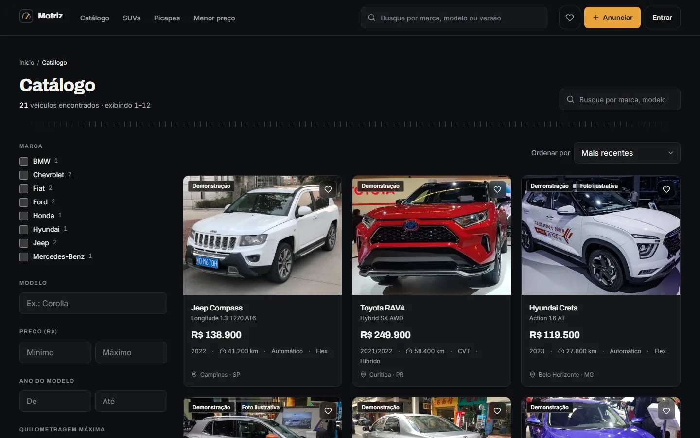
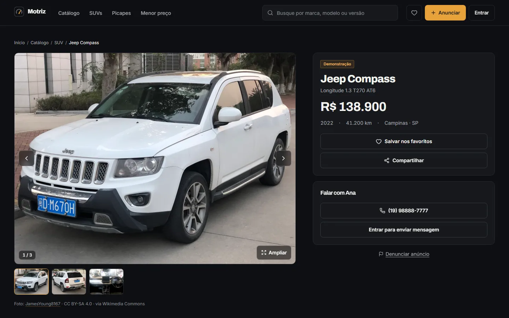
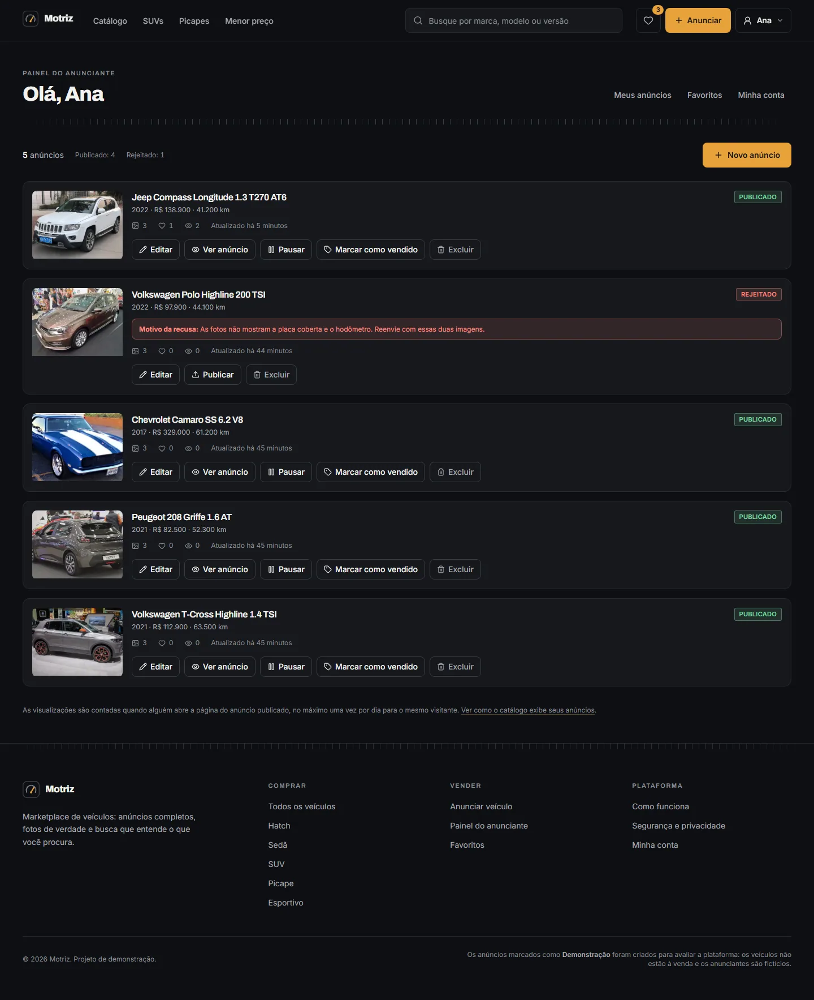
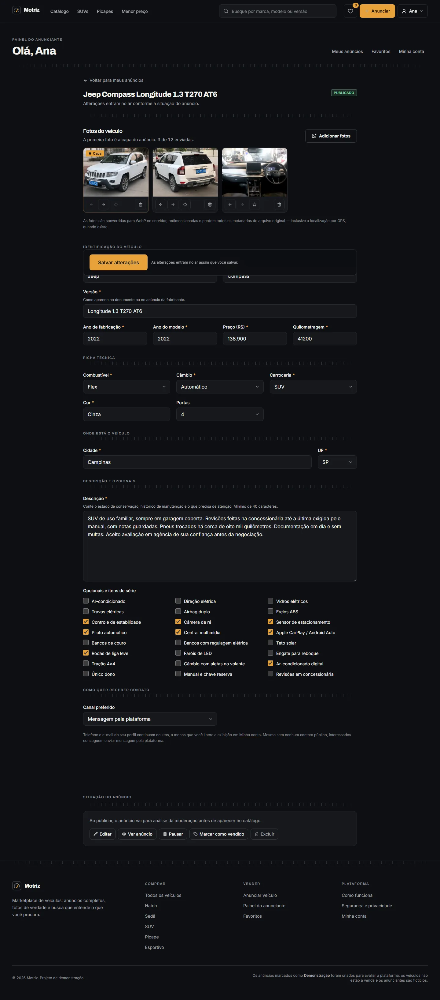
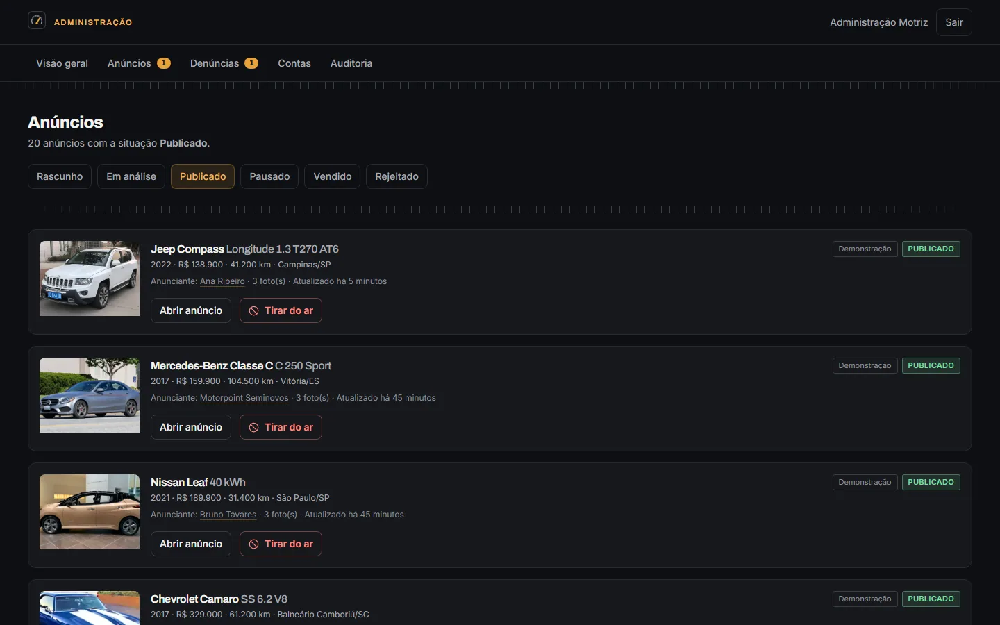
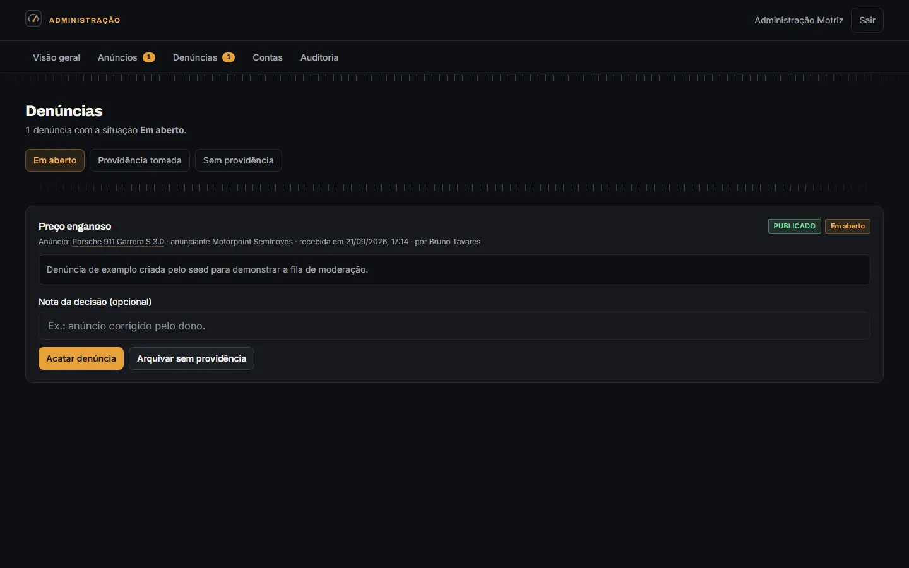
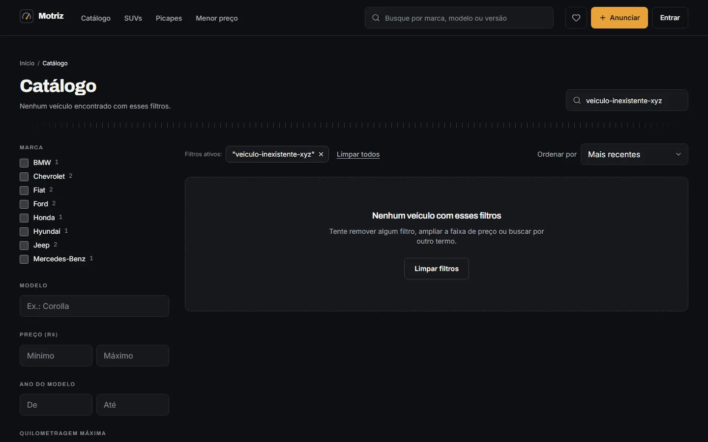
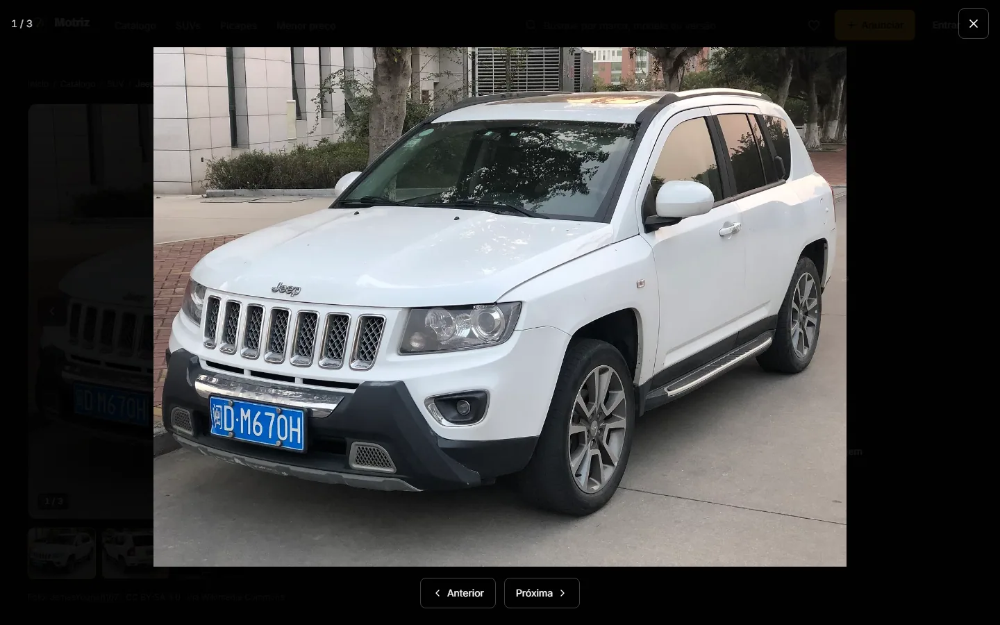
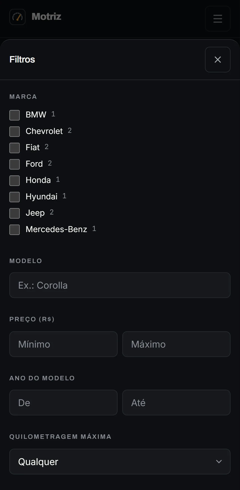
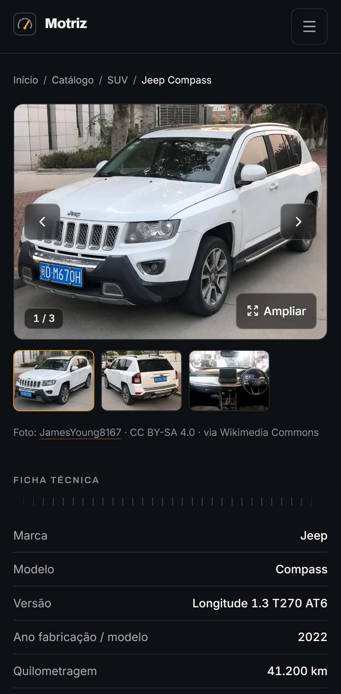

# Motriz

Marketplace de veículos, do anúncio com foto ao comprador que encontra pela busca.

Quem vende monta o anúncio, envia as fotos, escolhe a capa e acompanha as visitas.
Quem compra filtra por marca, preço, ano e quilometragem, favorita e fala com o
anunciante. No meio dos dois, uma **moderação** que aprova ou recusa com motivo.


## Índice

- [O que a plataforma faz](#o-que-a-plataforma-faz)
- [Telas](#telas)
- [Stack](#stack)
- [Como rodar](#como-rodar)
- [Testes](#testes)
- [Segurança](#segurança)
- [As fotografias](#as-fotografias)
- [Documentação](#documentação)
- [Limitações conhecidas](#limitações-conhecidas)
- [Autor](#autor)
- [Licença](#licença)

## O que a plataforma faz

**O caminho de um anúncio, do começo ao fim:**

1. O anunciante cria o anúncio e salva como **rascunho** — visível só para ele.
2. Envia as fotos, escolhe a **capa** e reordena na ordem que quiser.
3. Publica. Com a moderação ligada, o anúncio entra **em análise**.
4. A administração aprova, ou **recusa com motivo** — e o motivo aparece para o anunciante corrigir.
5. Aprovado, entra no catálogo e começa a contar visualizações.
6. O comprador acha pela busca, favorita, compartilha ou fala com o anunciante.
7. O anunciante pausa, marca como **vendido** ou exclui.

**Além do fluxo principal:**

- Catálogo com **12 filtros** — marca, modelo, preço, ano, quilometragem, combustível, câmbio, carroceria e localização — todos refletidos na URL, então a busca é compartilhável
- Ordenação por preço, ano, quilometragem ou data, com paginação
- Galeria com miniaturas, ampliação e navegação pelo teclado
- Favoritos que sobrevivem ao logout, porque ficam no banco
- Denúncia de anúncio que cai numa fila de moderação de verdade
- Cadastro, login, verificação de e-mail, recuperação de senha e exclusão de conta
- Controle de privacidade: o telefone e o e-mail só aparecem se o anunciante liberar
- Suspensão de anúncios e de contas, com motivo registrado e histórico administrativo

**O que a plataforma _não_ faz:** pagamento, financiamento, verificação de procedência,
chat interno e avaliação de usuário. Nada disso aparece simulado na interface — ver
[Limitações conhecidas](#limitações-conhecidas).

## Telas

<table>
<tr>
<td width="50%"></td>
<td width="50%"></td>
</tr>
<tr>
<td><b>Catálogo</b> — filtros com contagem por marca, ordenação e resultado contado</td>
<td><b>Anúncio</b> — galeria, preço, ficha técnica e o crédito da fotografia</td>
</tr>
<tr>
<td></td>
<td></td>
</tr>
<tr>
<td><b>Painel do anunciante</b> — situação de cada anúncio e o motivo da recusa em vermelho</td>
<td><b>Edição</b> — fotos, ficha, desempenho e as ações de publicar, pausar e vender</td>
</tr>
<tr>
<td></td>
<td></td>
</tr>
<tr>
<td><b>Administração</b> — anúncios por situação, com aprovar, recusar e tirar do ar</td>
<td><b>Denúncias</b> — fila de moderação com a decisão registrada em auditoria</td>
</tr>
<tr>
<td></td>
<td></td>
</tr>
<tr>
<td><b>Nenhum resultado</b> — estado vazio com saída, não uma tela em branco</td>
<td><b>Foto ampliada</b> — abre e fecha pelo teclado, com foco preso no diálogo</td>
</tr>
</table>

### No celular

<table>
<tr>
<td width="33%"></td>
<td width="33%"></td>
<td width="33%"></td>
</tr>
<tr>
<td><b>Início</b></td>
<td><b>Filtros</b> — em painel próprio, não espremidos na lateral</td>
<td><b>Anúncio</b></td>
</tr>
</table>

Todas as telas, em desktop e celular, estão em [docs/CAPTURAS.md](docs/CAPTURAS.md).

### O detalhe que organiza a página

Entre as seções corre uma **régua de instrumento**: uma linha de traços curtos com um
mais alto a cada cinco, igual à escala de um velocímetro. Ela faz o trabalho que um
título de seção faria, sem ocupar uma linha de texto — e é o mesmo desenho do símbolo
da marca, um conta-giros reduzido ao essencial com a agulha âmbar na faixa de potência.

O âmbar, aliás, tem uma regra: **só aparece onde há ação ou informação decisiva**.
Botão que faz alguma coisa, preço, anel de foco. Nunca decoração. É por isso que a
página não parece um painel de aviso mesmo com muita informação na tela.

E há a **inversão de superfície**: os componentes não sabem em que fundo estão, usam
sempre os mesmos tokens semânticos. Uma seção marcada como clara redefine os tokens
localmente. É por isso que a faixa branca "Publique o seu anúncio" na página inicial
usa exatamente o mesmo card do resto do site, sem uma linha de CSS alternativa.

## Stack

| Camada | Tecnologia |
| ------ | ---------- |
| Aplicação | Next.js 16 (App Router, Turbopack), React 19, TypeScript estrito |
| Dados | Prisma 7, SQLite, migrações versionadas |
| Interface | Tailwind CSS 4, design system próprio em tokens |
| Imagens | sharp — detecção por conteúdo, recodificação WebP, miniaturas |
| Segurança | bcryptjs, sessões em banco, validação com Zod |
| Testes | Vitest, Playwright |

```
prisma/        modelo de dados, migrações e o seed de demonstração
scripts/       fotos do Commons, catálogo fictício, validador de contraste
src/
  app/         rotas: (site), (auth), admin, api
  components/  interface reutilizável
  lib/         infraestrutura: db, auth, imagens, validação, limites
  server/      actions (escrita), queries (leitura), regras de negócio puras
storage/       uploads, deliberadamente fora de /public
tests/         unit, integration, e2e
docs/          documentação detalhada
```

**Por que SQLite:** para avaliar o projeto você precisa de Node e nada mais. Sem
Docker, sem banco externo, sem conta em serviço nenhum. A troca por PostgreSQL é uma
mudança de provider no Prisma — o raciocínio está em [docs/DECISOES.md](docs/DECISOES.md).

**Por que os uploads ficam fora de `/public`:** arquivo em `/public` é servido direto
pelo servidor de estáticos, sem passar por checagem nenhuma. Como a foto de um
**rascunho** não pode ser vista por mais ninguém, toda imagem passa por
`/api/midia/[...key]`, que confere a situação do anúncio antes de entregar o byte.

## Como rodar

**Requisitos:** Node.js 20.9 ou superior (testado no 22.18) e npm 10+. Nenhum banco externo.

### 1. Dependências e configuração

```bash
npm install
cp .env.example .env
```

Troque o `AUTH_SECRET` por um valor aleatório:

```bash
node -e "console.log(require('crypto').randomBytes(32).toString('hex'))"
```

### 2. Banco de dados

```bash
npm run db:migrate            # cria prisma/dev.db e aplica as migrações
```

### 3. Fotografias de demonstração

```bash
npm run photos:fetch          # baixa do Wikimedia Commons; precisa de internet
```

> Sem internet, **pule este passo**. O seed cria os anúncios como rascunho e avisa no
> terminal. O script é retomável: rodar de novo continua de onde parou.

### 4. Dados de demonstração e servidor

```bash
npm run db:seed               # 24 anúncios, 5 anunciantes e 1 administrador
npm run dev                   # http://localhost:3000
```

> O Next 16 **recusa dois `next dev` no mesmo diretório**. Se for rodar os testes
> ponta a ponta, encerre o servidor antes.

### Acessos criados pelo seed

As senhas vêm do `.env` (`SEED_ADMIN_PASSWORD` e `SEED_DEMO_PASSWORD`):

| E-mail | Papel | Senha padrão |
| ------ | ----- | ------------ |
| `admin@motriz.local` | Administração | `Motriz!Admin2024` |
| `ana.ribeiro@demo.motriz.local` | Anunciante | `Motriz!Demo2024` |
| `bruno.tavares@demo.motriz.local` | Anunciante | `Motriz!Demo2024` |
| `carla.menezes@demo.motriz.local` | Anunciante | `Motriz!Demo2024` |
| `contato.vertical@demo.motriz.local` | Anunciante (loja) | `Motriz!Demo2024` |
| `vendas.motorpoint@demo.motriz.local` | Anunciante (loja) | `Motriz!Demo2024` |

O seed deixa de propósito **um anúncio recusado** e **um esperando análise**, para a
fila de moderação não nascer vazia. Todo anúncio criado por ele carrega o selo
**Demonstração** e não corresponde a veículo à venda.

### E-mails em desenvolvimento

`MAIL_TRANSPORT="console"` (o padrão) **não envia e-mail de verdade**. As mensagens são
gravadas em `log/emails.log` e impressas no terminal — é de lá que se pega o link de
confirmação de e-mail e o de redefinição de senha.

## Testes

```bash
npm run typecheck && npm run lint && npm run build
npm test                      # unidade e integração
npm run test:e2e              # Playwright: desktop e celular
npm run audit:deps            # npm audit nas dependências de produção
npm run check:contraste       # contraste de todos os pares de cor
```

| Verificação | Resultado |
| ----------- | --------- |
| `typecheck` · `lint` · `build` | sem erros |
| `npm test` | **105 testes**, 6 arquivos |
| `npm run test:e2e` | **52 testes**, desktop 1440×900 e Pixel 7 |
| `npm run audit:deps` | **0 vulnerabilidades** |
| `npm run check:contraste` | **23/23 pares** acima do WCAG AA |

Os 105 testes de unidade e integração cobrem o que quebra regra de negócio ou
segurança: a tradução entre URL e consulta do catálogo, as transições de situação do
anúncio, a validação de entrada, o ciclo de sessão e a leitura real do cabeçalho das
imagens enviadas.

Dos 52 testes ponta a ponta, **18 são só de autorização** — e boa parte ataca por
**requisição HTTP direta**, não pela interface: conta A tentando enviar foto para o
anúncio de B, reordenar as fotos de B, apagar arquivo de B, abrir rascunho de B,
usuário comum batendo em todas as telas administrativas, chave de mídia tentando
escapar do diretório. Um deles confirma que a foto de B **continua existindo** depois
das tentativas, porque "negou o acesso" e "corrompeu o dado no caminho" são coisas
diferentes.

Os testes ponta a ponta usam banco próprio (`prisma/e2e.db`), diretório de uploads
próprio e porta própria. Não encostam nos dados de desenvolvimento.

**Quatro defeitos reais apareceram aqui**, e o mais instrutivo foi o terceiro: o slug
era recalculado a cada edição, então a primeira alteração depois de publicar **mudava
a URL e quebrava todo link já compartilhado**. Nenhuma peça isolada estava errada — o
problema era a ordem. Só um teste de ponta a ponta acha isso. Os quatro estão
descritos em [docs/TESTES.md](docs/TESTES.md).

## Segurança

[docs/SEGURANCA.md](docs/SEGURANCA.md) mapeia 15 ameaças e aponta onde cada uma é
tratada. O resumo:

- **Senha** com bcrypt custo 12, mínimo de 10 caracteres seguindo o NIST SP 800-63B,
  com bloqueio de senhas notoriamente comuns. Nenhuma criptografia própria.
- **Sessão** com token de 32 bytes aleatórios; o banco guarda só o SHA-256 dele, então
  um dump não permite assumir sessão. Conta suspensa, troca de senha ou redefinição
  encerram **todas** as sessões.
- **Limite de tentativas** no login contado em dois eixos, por IP e por e-mail — um
  pega o ataque distribuído, o outro a força bruta numa conta só.
- **Autorização** verificada no servidor em toda operação, com a propriedade dentro da
  própria consulta: `getListingForEdit(id, sellerId)` filtra pelos dois de uma vez, e
  id alheio simplesmente não retorna linha. Não existe aqui o "carrega e depois
  compara", que é onde falha de autorização costuma nascer.
- **Upload** validado pelo cabeçalho real do arquivo via sharp — extensão e MIME do
  navegador não entram na decisão. SVG é recusado de propósito. O nome sai do servidor
  e a recodificação para WebP **descarta o EXIF inteiro, GPS incluído**.
- **Visibilidade** com uma autoridade única, injetada na cláusula `WHERE` antes de
  qualquer filtro. Rascunho não vaza pela URL, nem pela API, nem pela foto.
- **Cabeçalhos** de CSP, `nosniff`, `X-Frame-Options: DENY`, `Referrer-Policy`,
  `Permissions-Policy` e `Cross-Origin-Opener-Policy`.

Tudo isso foi testado **contra esta instalação local, com dados fictícios**. Nenhum
sistema de terceiro foi testado, e nada foi publicado em produção.

## As fotografias

São **72 fotografias reais**, em 24 anúncios, baixadas do Wikimedia Commons por
`npm run photos:fetch`. O script só aceita **licença livre** — CC0, CC BY, CC BY-SA e
domínio público — e recusa qualquer outra, inclusive não comercial e "uso justo".

Autor, licença e link de origem ficam no banco e aparecem **na página do anúncio**,
abaixo da galeria. De 72 imagens, **54 têm o ano confirmado**; as outras **18 entram
marcadas como ilustrativas**, com aviso no card e faixa sobre a foto, porque associar
foto a modelo e ano sem confirmar seria inventar.

A lista completa, imagem por imagem, está em [docs/IMAGENS.md](docs/IMAGENS.md).

## Documentação

| Documento | O que traz |
| --------- | ---------- |
| [Decisões](docs/DECISOES.md) | Escolhas técnicas e de design, com o porquê de cada uma |
| [Segurança](docs/SEGURANCA.md) | As 15 ameaças consideradas e o que foi feito sobre cada |
| [Testes](docs/TESTES.md) | O que foi executado, o resultado e os defeitos encontrados |
| [Imagens](docs/IMAGENS.md) | Origem, autor e licença de cada fotografia |
| [Privacidade](docs/PRIVACIDADE.md) | Dados coletados, retenção e exclusão de conta |
| [Implantação](docs/IMPLANTACAO.md) | Publicação, backup e recuperação |
| [Capturas](docs/CAPTURAS.md) | Todas as telas, em desktop e celular |
| [Pendências](docs/PENDENCIAS.md) | Limitações conhecidas e o que falta configurar |

## Limitações conhecidas

Coisas que a plataforma **não** faz, e que são decisão consciente, não esquecimento:

- **Não envia e-mail de verdade.** O transporte implementado é o `console`, que grava
  em `log/emails.log`. Verificação de e-mail e recuperação de senha **não funcionam
  fora do ambiente local** sem ligar um provedor.
- **Não tem segundo fator para administrador.** O lugar está preparado, a
  implementação não existe.
- **A CSP ainda tem `unsafe-inline` no `script-src`**, o que reduz a proteção contra
  XSS. Resolver exige nonce por requisição.
- **O armazenamento é disco local.** Em plataforma efêmera, os uploads somem a cada
  publicação. Precisa de storage externo (S3 ou compatível).
- **Não processa pagamento nem financiamento**, e não simula nenhum dos dois na tela.
- **Não verifica procedência de veículo** nem integra com base de débitos ou sinistro.
- **O nome "Motriz" é provisório.** Não foi feita verificação de marca, domínio ou
  registro — se o projeto for adiante, isso precisa ser checado antes de qualquer coisa.
- **Nada aqui declara conformidade legal.** O tratamento de dados foi desenhado com
  cuidado e está descrito em [Privacidade](docs/PRIVACIDADE.md), mas revisão jurídica
  é necessária antes de uso real.

## Autor

**Weslley Soares** — [@WeslleySoaress](https://github.com/WeslleySoaress)

## Licença

MIT — veja [LICENSE](LICENSE). Use, modifique e distribua à vontade, mantendo o aviso
de copyright.

As **fotografias de demonstração não são MIT**: cada uma tem a licença do seu autor no
Wikimedia Commons, listada em [docs/IMAGENS.md](docs/IMAGENS.md). CC BY e CC BY-SA
exigem crédito ao autor e, no caso do CC BY-SA, que derivações mantenham a mesma
licença. O alcance exato está em [NOTICE](NOTICE).
